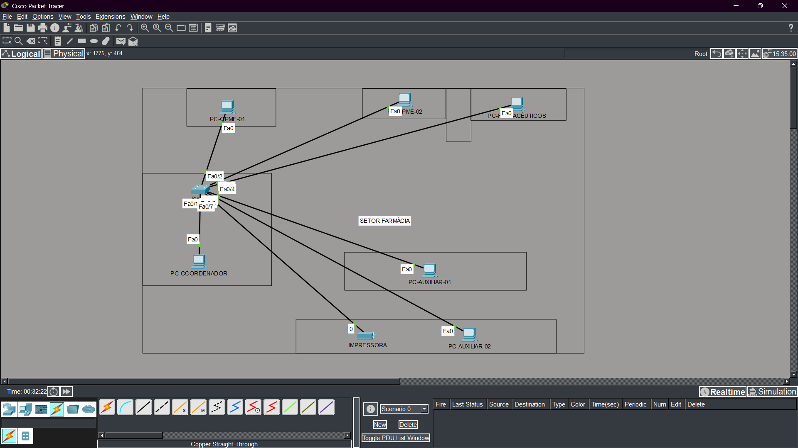
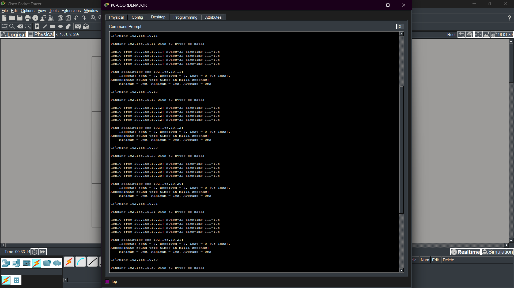
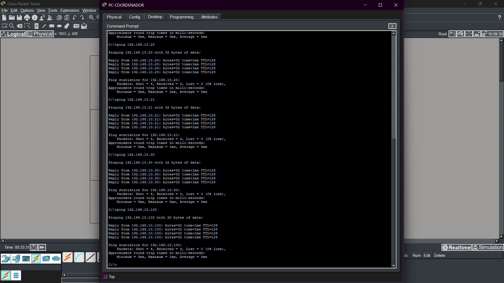

# 🏥 Projeto 02 - Rede Local de Farmácia Hospitalar


## 📌 Sobre o Projeto

Este projeto foi desenvolvido utilizando o Cisco Packet Tracer e tem como objetivo simular a infraestrutura básica de rede de uma farmácia hospitalar.

O cenário foi inspirado em um ambiente real de trabalho e contempla estações utilizadas pela coordenação, auxiliares de farmácia, equipe de OPME, farmacêutico responsável e uma impressora compartilhada.

A topologia foi adaptada para fins educacionais, incluindo um switch Cisco 2960 para permitir a prática de conceitos relacionados a redes locais (LAN), switching e comunicação entre dispositivos.

## 🎯 Objetivos de Aprendizagem

* Planejar uma rede local baseada em um cenário real;
* Configurar endereçamento IPv4 estático;
* Compreender o funcionamento de switches em redes locais;
* Validar a comunicação entre dispositivos através do protocolo ICMP (Ping);
* Praticar documentação técnica de infraestrutura.

## ⚠️ Observação

Este projeto foi inspirado em um ambiente real de farmácia hospitalar, porém não representa necessariamente a infraestrutura utilizada pela instituição.

Alguns elementos da topologia foram adicionados para fins didáticos e de aprendizado em redes de computadores.

## 🖼️ Topologia da Rede




## 🏢 Estrutura Simulada

### Setor Farmácia

* PC-Coordenador
* PC-Auxiliar-01
* PC-Auxiliar-02
* PC-OPME-01
* PC-OPME-02
* PC-Farmaceutico
* Printer-01

### Infraestrutura

* SW-01 (Cisco 2960)

## 🌐 Endereçamento IP

| Dispositivo           | Endereço IP    |
| --------------------- | -------------- |
| PC-Coordenador        | 192.168.10.10  |
| PC-Auxiliar-01        | 192.168.10.11  |
| PC-Auxiliar-02        | 192.168.10.12  |
| PC-OPME-01            | 192.168.10.20  |
| PC-OPME-02            | 192.168.10.21  |
| PC-Farmaceutico       | 192.168.10.30  |
| Printer-01            | 192.168.10.100 |

### Rede Utilizada

```text
192.168.10.0/24
```

Máscara de Sub-rede:

```text
255.255.255.0
```

## ⚙️ Configurações Realizadas

### Hosts

* Configuração manual de endereços IPv4;
* Testes de conectividade entre dispositivos.


## 🧪 Testes Realizados

Foram realizados testes de conectividade utilizando o protocolo ICMP (Ping) entre os dispositivos da rede.

### Exemplo

```bash
ping 192.168.10.11
ping 192.168.10.12
ping 192.168.10.20
ping 192.168.10.21
ping 192.168.10.30
ping 192.168.10.100
```

### Evidências






## 🛠️ Tecnologias Utilizadas

* Cisco Packet Tracer
* Cisco IOS
* IPv4
* Ethernet
* ICMP
* Redes de Computadores

## 👩‍💻 Autora

Nicolle Assis

Estudante de Tecnologia da Informação com foco em Redes de Computadores e Infraestrutura.

* GitHub: https://github.com/nicolle-assis
* LinkedIn: https://www.linkedin.com/in/nicolle-assis

## 📄 Licença
MIT License

Este projeto foi desenvolvido para fins educacionais e de aprendizado.
